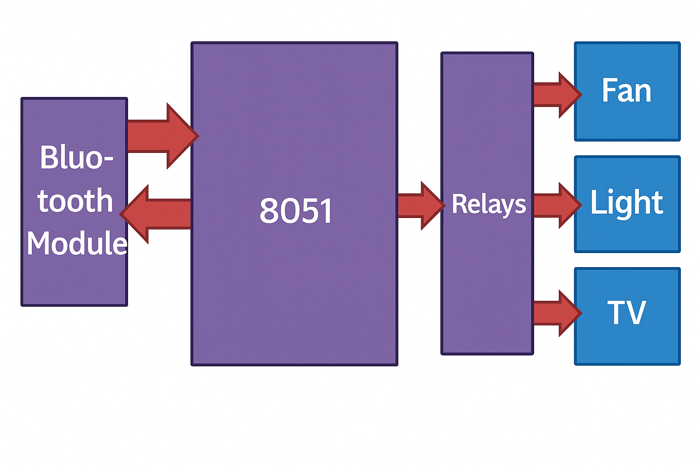
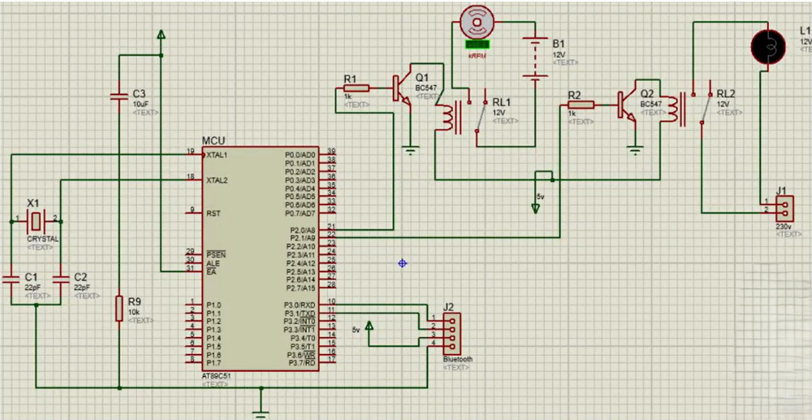

<h1>🏠 Home Automation System using 8051 (W78E052D) & HC-05 Bluetooth</h1>

This embedded project controls appliances such as a <strong>fan</strong> and <strong>lamp</strong> using an <strong>8051-based microcontroller (W78E052D)</strong> and an <strong>HC-05 Bluetooth module</strong>. Commands are sent wirelessly from an Android phone using the <strong>Android Bluetooth Controller</strong> app.

<h2>📷 Project Diagrams</h2>

<h3>📦 Block Diagram</h3>

<h3>🔌 Proteus Circuit Simulation</h3>

<h2>💡 Features</h2>
<ul>
  <li>Wireless control of fan and lamp using smartphone</li>
  <li>HC-05 Bluetooth module with UART interface</li>
  <li>Relays switch 230V AC loads safely</li>
  <li>Status feedback over UART</li>
</ul>

<h2>🔧 Hardware Used</h2>
<ul>
  <li>W78E052D Microcontroller</li>
  <li>HC-05 Bluetooth Module</li>
  <li>Relay Modules</li>
  <li>Fan and Lamp</li>
  <li>+5V Regulated Power Supply</li>
</ul>

<h2>📲 Command Control</h2>
<ul>
  <li><code>1</code> → Lamp ON</li>
  <li><code>2</code> → Lamp OFF</li>
  <li><code>3</code> → Fan ON</li>
  <li><code>4</code> → Fan OFF</li>
</ul>

<h2>📥 Uploading HEX to W78E052D</h2>

Use <strong>Nuvoton Writer</strong> software:

<ol>
  <li>Connect the W78E052D via programmer or ISP</li>
  <li>Select <code>W78E052D</code> in the software</li>
  <li>Load the compiled HEX file (not included in this repo)</li>
  <li>Click <strong>Program</strong> to flash the device</li>
</ol>

<h2>📱 Mobile App</h2>
<ul>
  <li><strong>App Name:</strong> Android Bluetooth Controller</li>
  <li><strong>Platform:</strong> Android</li>
  <li><strong>Function:</strong> Sends characters 1–4 over Bluetooth</li>
</ul>

<h2>🛠 Tools Used</h2>
<ul>
  <li>Keil µVision5</li>
  <li>Proteus</li>
  <li>Nuvoton Writer</li>
  <li>Android Bluetooth Controller App</li>
</ul>

<strong>Author:</strong> Harshal Pachange 
<strong>Microcontroller:</strong> W78E052D 
<strong>Bluetooth Module:</strong> HC-05 
<strong>Project Type:</strong> Bluetooth-based Home Automation

